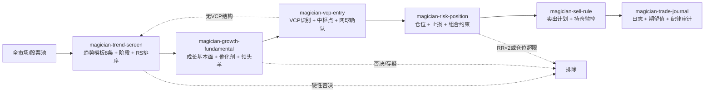

# 股票魔法师方法论 Skill 化设计文档

> **版本**：v0.1（设计稿）  
> **日期**：2026-08-11  
> **状态**：待评审（Phase 0）  
> **实施进度**：Phase 1-4 已落地（2026-08-11）—— `tools/magician_data.py`（bars/trend/rs/stage）、`tools/vcp_detector.py`（detect/scan）、`tools/magician_backtest.py`（回测+参数扫描）均已实现并验证（数据后端：ai2miniqmt xtquant 前复权日线 + 全市场日线缓存）；7 个 `skills/magician-*.md` 已编写并经 `scripts/sync-codex-skills.py` 同步；Phase 4 回测报告见 `reports/magician-vcp-backtest-20260811.md`，据此修订：收缩≥3次优先、止损7%/10%、RR计划目标≥3、RS不作一票否决、追高≤15%、新增大盘环境过滤。Phase 4 复核（2026-08-11）：评估日加密到日度（1601 个交易日）并用带成交量实时数据复核，报告见 `reports/magician-vcp-backtest-daily-20260811.md` 与 `reports/magician-vcp-calibration-daily-20260811.md`；结论：日度评估笔数×4、期望改善；**量能萎缩（末段≤首段60%）为核心增强条件（期望+0.9~1.7pp）**；突破放量确认不单独过滤；RS≥90 在带量萎缩过滤下转正（样本小）；2023-2026 期望不再归零。P0 大盘环境分组回测（2026-08-11，`reports/magician-vcp-regime-20260811.md`）：指数 MA200 对裸 VCP 有弱区分力（up +1.91% vs down +0.72%），对量能萎缩强信号无增量（down 段期望 ≥ up 段，样本小）；最强组合 up_wide+dy+RS≥90 期望 +10.9%（n=38）。结论：大盘环境从硬开关改为**仓位系数**（up_wide×1.0 / up×0.8 / down×0.5），只保留 down 段最强信号。P1 基本面漏斗（2026-08-11，`reports/magician-vcp-funnel-20260811.md`）：质量红线（ST/负债率≤85%/现金流利润比≥0.7/毛利率≥15%/年报ROE≥8%）通过率 40%，叠加营收同比≥15%（point-in-time）通过率 12%；漏斗 F0→F1→F2 单调抬升期望（mc2 rs0 dy1：+2.69%→+3.50%→+4.28%；mc3 rs0 dy1：+2.38%→+4.64%→+6.98%），且中位数改善（削左尾）；营收加速过严弃用（通过率3%）、PB 分位不作硬否决。漏斗顺序：趋势→基本面→VCP+量能。P2 组合级回测（2026-08-12，`reports/magician-vcp-portfolio-20260812.md`）：新增事件驱动组合模拟器 `tools/magician_portfolio.py`（风险平价仓位/最多6仓/80日锁仓/逐日净值）；F1+量能萎缩+收缩≥3 组合年化 9.0%、最大回撤 -18.9%（1601 交易日，2020-01~2026-08），同期沪深300 累计 +10.5% vs 策略 +73%；平均暴露仅 19~31%（现金拖累为主要成本）；F2 组合层不值得（暴露10%）；大盘环境系数为“收益换回撤”的可选项。推荐参数 v5 已写入 skill。
> **适用范围**：ai-berkshire 仓库新增「magician-*」skills 与配套工具  
> **输入资料**：`docs/Magician/` 下《股票魔法师》系列四本书（已提取章节文本于本地临时目录）

---

## 1. 背景与目标

### 1.1 背景

`docs/Magician/` 收录了《股票魔法师》系列四本书：

| 书 | 主题 | 提取章节 |
|---|---|---|
| 《纵横天下股市的奥秘》 | SEPA 策略、四阶段、VCP、风险管理 | `b1_ch3_sepa` ~ `b1_ch13_risk2` |
| 《像冠军一样思考和交易》 | 趋势模板、买卖与头寸、交易真相 | `b2_ch1_plan` ~ `b2_ch10_keys` |
| 《趋势交易圆桌访谈》 | 四位大师实战共识（止损清仓、五大交易原则） | 并入相关 skill 的规则来源 |
| 《赢家法则》 | 纯心理训练（与书二心态章节重合） | 暂不独立成 skill，要点并入纪律审计 |

仓库现有 20 个 skills 与 12+ 个工具，整体偏向**价值投资研究**（巴菲特-芒格-段永平体系）与**研报产出**，缺少量价趋势筛选、交易执行、仓位风控、交易复盘这一类"交易型"能力。本设计把书中可操作的方法论沉淀为可执行的 skills，与现有体系互补而非冲突。

### 1.2 目标

1. 新增 7 个 `magician-*` skills，覆盖「选股 → 买入 → 持仓 → 卖出 → 复盘」完整闭环。
2. 新增 2 个配套工具（趋势模板判定、VCP 识别），补齐现有工具缺失的 K 线/均线/RS/VCP 能力。
3. 完全兼容仓库既有规范：`skills/*.md` 为源头，经 `scripts/sync-codex-skills.py` 生成 `codex-skills/*/SKILL.md`；工具沿用"stdlib + curl、零依赖、子命令式"风格。
4. 优先做 A 股适配（T+1、涨跌停、复权、财报披露节奏）。

### 1.3 非目标

- 不替代现有价值投资 skills（`quality-screen`、`investment-checklist` 等）。
- 不做高频/日内交易决策。
- 不承诺收益，只做结构化决策支持。
- 不把书籍全文入库（`docs/Magician/` 保持 gitignore）。

### 1.4 设计原则

- **先设计后执行**：本文档通过评审后才进入工具与 skill 落地。
- **可追溯**：每条关键规则标注来源章节（`b1_ch*`、`b2_ch*`），便于核对与后续修订。
- **漏斗式硬性否决优先**：先排除，再评分；任一硬性否决即终止，不用加权分掩盖。
- **小而专**：每个 skill 职责单一、可单独触发、可串联编排。
- **A 股本地化**：参数默认值来自原书，但需在 A 股样本上校准（Phase 4）。

---

## 2. 方法论梳理

### 2.1 SEPA 体系全景

SEPA（Specific Entry Point Analysis，特定进场点分析）是整套方法论的内核：**趋势、基本面、催化剂、买入时机、卖出时机**五要素同时收敛才交易。

| 要素 | 要点 | 来源章节 | 落点 skill |
|---|---|---|---|
| 趋势 | 只买第二阶段上升趋势；趋势模板 8 条 | b1_ch5、b1_ch11 | magician-trend-screen |
| 基本面 | 净利润/收入加速、EPS 惊喜、质量 | b1_ch7、b1_ch8 | magician-growth-fundamental |
| 催化剂 | 新产品、新管理层、行业景气、分析师上调 | b1_ch6、b1_ch7 | magician-growth-fundamental |
| 买入时机 | VCP 收缩完毕、中枢点突破、量能确认 | b1_ch10 | magician-vcp-entry |
| 卖出时机 | 强势卖出/弱势卖出、晚期警告信号 | b2_ch9 | magician-sell-rule |

### 2.2 四阶段理论与趋势模板 8 条

- **阶段划分**：第一阶段（筑底/忽略）、第二阶段（上升/唯一可买）、第三阶段（派发/危险）、第四阶段（下跌/禁止）。
- **趋势模板 8 条**（全部满足才算第二阶段确认，来源 b1_ch5）：

1. 收盘价 > 150 日均线（200 日亦可）。
2. 收盘价 > 200 日均线。
3. 200 日均线至少上行 1 个月。
4. 50 日均线 > 150 日均线 > 200 日均线。
5. 收盘价 > 50 日均线。
6. 股价距 52 周低点 ≥ 25%。
7. 股价距 52 周高点 ≤ 25%（越接近新高越好）。
8. RS 相对强度 ≥ 70（最好 ≥ 90，来源 b1_ch9）。

### 2.3 VCP 与买点

- **VCP（波动收缩模式）**：上升趋势中的回调基底，回调幅度逐次收缩（示例序列 32% → 14% → 3%），成交量同步萎缩，代表浮筹出清、供需临近失衡。
- **技术足迹**：用「宽度W / 收缩比 / 收缩次数T」描述基底，如 `6W 32/6 3T` = 基底 6 周、波动从 32% 收窄到 6%、3 次收缩。
- **中枢点**：基底内收缩区间的高点，收盘放量突破中枢点即为买点。
- **网球 vs 鸡蛋**：回调缩量、快速反弹（网球）才值得持有；阴跌不止（鸡蛋）应放弃（来源 b2_ch10）。

### 2.4 成长基本面与领头羊

- 净利润与收入连续加速（同比/环比），EPS 惊喜（超预期）。
- 分析师盈利预测上调是催化剂信号之一。
- 领头羊原则："要成为赢家必须创新高"——只关注板块内率先创新高、RS 最高的标的。

### 2.5 风险管理与头寸（来源 b1_ch12、b1_ch13、b2_ch2、b2_ch8）

| 规则 | 数值/表述 |
|---|---|
| 单笔风险 | 账户资金的 1.25% – 2.5% |
| 最大止损 | 单笔 ≤ 10%（一般 5–6% 触发） |
| 平均亏损目标 | 5 – 6% |
| 盈亏比 RR | ≥ 2:1（否则不交易） |
| 期望值 | E = 胜率×平均盈利 − 败率×平均亏损（长期为正才玩） |
| 加仓 | 永不摊低成本；只用盈利加仓（二换一：卖出弱者换入强者） |
| 50/80 法则 | 持仓盈利后保护止损上移，避免利润回吐 |
| 组合集中度 | 4 – 8 只；最优 4 – 5 只，各 20 – 25% |
| 试探仓 | 新交易先小仓（1/3 – 1/2 目标仓），确认后再加 |

### 2.6 卖出法则（来源 b2_ch9、b1_ch13）

- **弱势卖出**：跌破止损位、跌破 50 日均线、盈利回吐超阈值。
- **强势卖出**：放量滞涨、远离均线加速赶顶、上涨日占比过高。
- **盈亏平衡或更好法则**：持仓盈利后，止损至少移到成本价。
- **晚期警告清单**：第 4/5 个基底、PE 扩张至基准 2 倍、70% 以上为上涨日、放量长阴反转、MVP 指标（15 个交易日 12 天上涨）。

### 2.7 交易真相与纪律（来源 b2_ch1、b2_ch4）

- 交易日志：每笔记录买/卖/仓位/止损/结果/是否守纪律。
- 周期统计：胜率、平均盈亏、期望值、最大回撤，用结果校准参数（RBA）。
- 纪律陷阱：情绪、意见、自负三大陷阱；"就这一次"的破例是亏损之源。

---

## 3. 现有仓库体系分析

### 3.1 skills 现状（20 个）

| 类别 | 现有 skill | 与 Magician 的关系 |
|---|---|---|
| 价值筛选 | quality-screen、industry-funnel、investment-checklist | 互补：价值质量 vs 成长趋势 |
| 公司研究 | investment-research、deep-company-series、industry-research、management-deep-dive、private-company-research | 互补：基本面纵深研究 |
| 财报与数据 | earnings-review、earnings-team、financial-data | 复用其数据获取规范 |
| 持仓与追踪 | portfolio-review、thesis-tracker、thesis-drift | 互补：长期论文追踪 vs 交易持仓管理 |
| 组合与输出 | investment-team、wechat-article、news-pulse、bottleneck-hunter、income-investment、dyp-ask | 无直接冲突 |

### 3.2 skill 文件规范与生成机制

- 源头：`skills/*.md`（UTF-8，一级标题 + 正文，可选 YAML frontmatter），是唯一可编辑版本。
- 生成：`python3 scripts/sync-codex-skills.py` → `codex-skills/<name>/SKILL.md`，自动注入 `name` / `description` 与 Codex adapter note。
- 校验：`python3 scripts/sync-codex-skills.py --check`（CI 用）。
- 禁忌：**不可手改生成文件**；改源头后必须重新生成。
- 触发：`description` 字段供 Codex 自动发现，命名需清晰、含触发关键词。

### 3.3 工具现状与风格

- 现有工具：`ashare_data.py`（A股行情/财务/估值）、`twstock_data.py`（台股）、`financial_rigor.py`（财务校验）、`report_audit.py`（研报审计）、`stock_screener.py`、`momentum_backtest*.py`、`xueqiu_scraper.py`、`morningstar_fair_value.py` 等。
- 风格约束：argparse 子命令、`curl --noproxy` 直连、自动处理 GBK/UTF-8、JSON 输出、仅 stdlib、可被 skills 以 `python3 tools/xx.py subcmd ...` 调用。

### 3.4 缺口分析

| 能力 | 现状 | 结论 |
|---|---|---|
| 日线 K 线 / 均线 / 复权 | 无专门工具 | 新增 `magician_data.py` |
| 趋势模板 8 条判定 | 无 | 新增 `magician_data.py trend` |
| 相对强度 RS | 无 | 新增 `magician_data.py rs` |
| VCP 识别与足迹 | 无 | 新增 `vcp_detector.py` |
| 财务/估值数据 | `ashare_data.py` | 直接复用 |
| 一致性/审计 | `financial_rigor.py`、`report_audit.py` | 直接复用 |

---

## 4. 总体架构

### 4.1 流程漏斗（magician-sepa 编排）



任一环节硬性否决即终止；`magician-sepa` 负责按用户请求编排子 skill 并汇总为交易计划卡。

### 4.2 Skill 全景表

| Skill | 一句话职责 | 核心产出 | 主要工具依赖 |
|---|---|---|---|
| magician-sepa | 入口编排，漏斗式筛选并输出交易计划卡 | 交易计划卡（含硬性否决） | 全部子 skill |
| magician-trend-screen | 趋势模板 8 条 + 阶段判断 + RS 排序 | 候选池表 | magician_data.py |
| magician-growth-fundamental | 成长基本面、催化剂、领头羊三档结论 | 通过/存疑/否决及依据 | ashare_data.py、financial_rigor.py |
| magician-vcp-entry | VCP 识别、足迹、中枢点买点 | 买入清单（买点/止损/目标） | vcp_detector.py |
| magician-risk-position | 仓位公式、组合集中度、加仓规则 | 仓位计算表 | 无（读持仓） |
| magician-sell-rule | 卖出信号清单、盈亏平衡法则、持仓监控 | 持仓监控表 | magician_data.py |
| magician-trade-journal | 交易记录、期望值统计、纪律审计 | 复盘报告 | 无 |

### 4.3 数据流

- 输入：股票代码/名称、股票池文件（`data/watchlist.json` 或临时池）、账户与持仓（`实盘记录/`、`data/`）。
- 中间产物：候选池 JSON/表、VCP 扫描结果、交易计划卡、持仓监控表、交易日志。
- 建议存放：`data/magician/*.json`（计划与日志）、`reports/`（复盘报告）。

---

## 5. 各 Skill 详细设计

统一结构：定位 / 触发 / 输入 / 流程 / 关键规则与硬性否决 / 输出 / 工具依赖 / 边界。

### 5.1 magician-sepa（入口编排）

- **定位**：总入口，把"帮我按股票魔法师方法分析 XX"这类请求拆成漏斗并汇总。
- **触发**：用户提到"股票魔法师 / SEPA / 魔法师 / 趋势交易 / VCP"且意图是选股或建仓。
- **流程**：
  1. 明确标的池（代码、股票池、行业、市场）与账户约束（资金、现有持仓）。
  2. 依次调用 trend-screen → growth-fundamental → vcp-entry。
  3. 命中硬性否决即输出否决原因并终止该标的。
  4. 对通过者计算 risk-position 仓位与 sell-rule 卖出计划。
  5. 输出交易计划卡；提示写入 trade-journal。
- **硬性否决清单**：
  - 非第二阶段或趋势模板通过数 < 8（可注明豁免项）。
  - RR < 2:1。
  - 单笔止损 > 10%。
  - 组合持仓 > 8 只或单一板块 > 2 只且无换出对象。
  - 基本面否决（财报爆雷/ST/退市风险）。
  - 无 VCP 结构时不得追高买入（只能放入观察池）。
- **输出**：交易计划卡（见附录 C）。

### 5.2 magician-trend-screen

- **流程**：拉取日线（前复权）→ 逐条判定趋势模板 8 条 → 阶段判定 → 计算 RS → 输出排序候选池。
- **关键规则**：8 条全过才标"通过"；记录每条通过/失败明细，便于豁免判断；RS ≥ 70（最好 ≥ 90）排序。
- **输出**：候选池表：代码/名称/阶段/模板通过数/RS/收盘 vs 50-150-200 均线/距高低点/近 1 月涨幅。
- **工具**：`python3 tools/magician_data.py trend CODE`、`rs CODE`、`bars CODE`。

### 5.3 magician-growth-fundamental

- **流程**：拉取核心财务（净利润/营收，近 5-8 个季度）→ 计算同比/环比加速 → 检查 EPS 惊喜与分析师信号 → 判断领头羊地位 → 三档结论。
- **三档结论**：
  - **通过**：营收与净利润均加速（或净利高增且营收改善），无暴雷信号。
  - **存疑**：一项指标走弱但可解释（如季节性/一次性），需人工复核。
  - **否决**：连续 2 季度净利下滑、现金流恶化、审计异常、ST/退市风险。
- **边界**：只判"成长性"，不重复 quality-screen 的价值质量项；领头羊用 RS 排名 + 板块内新高数近似。
- **工具**：`ashare_data.py financials/valuation`、`financial_rigor.py`。

### 5.4 magician-vcp-entry

- **流程**：对候选池运行 VCP 检测 → 人工复核结构 → 输出买点清单。
- **关键规则**：
  - 收缩序列至少 2 次且幅度递减；量能随收缩逐级萎缩。
  - 技术足迹格式 `6W 32/6 3T`（宽度/起止收缩比/收缩次数）。
  - 买点 = 中枢点收盘放量突破（容差默认 1%）；错过则等回踩不破中枢点。
  - 网球确认：回调缩量快速反弹才列入；阴跌（鸡蛋）放弃。
  - 止损 = 中枢点下方 7–10% 或基底最低点（两者取高者）。
- **输出**：买入清单：代码/足迹/中枢点/触发价/止损价/预估 R（目标按 RR≥2）。
- **工具**：`python3 tools/vcp_detector.py detect CODE`、`scan --pool ...`。

### 5.5 magician-risk-position

- **流程**：读取账户资金与现有持仓 → 按公式计算仓位 → 检查组合约束 → 给出加仓/换仓建议。
- **关键规则**：
  - 单笔风险默认 1.5%（范围 1.25–2.5%）。
  - 股数 = 账户资金 × 风险% ÷（买价 − 止损价）。
  - 组合 4–8 只、最优 4–5 只；同板块最多 2 只；单只初始 ≤ 25%。
  - 试探仓 = 目标仓 1/3–1/2，确认后加至目标。
  - 永不摊低成本；加仓只用盈利（二换一）。
  - 50/80 法则：盈利后保护止损上移至成本或 50 日均线。
- **输出**：仓位计算表（资金/风险/买价/止损/股数/占比/是否超限）。
- **工具**：读 `实盘记录/` 与 `data/` 持仓，无新增工具。

### 5.6 magician-sell-rule

- **流程**：读取持仓与最新行情 → 逐项检查卖出信号 → 输出行动表。
- **关键规则**：
  - 弱势卖出：跌破止损 / 跌破 50 日均线（盈利单）/ 亏损 5–6% 且无反弹。
  - 强势卖出：放量滞涨、上涨日占比 ≥ 70%、远离均线加速、MVP 触发。
  - 盈亏平衡或更好：盈利单止损上移不低于成本。
  - 晚期警告：第 4/5 基底、PE 扩张 ≥ 2 倍、放量长阴。
- **输出**：持仓监控表：标的/成本/现价/止损位/状态（持有/减仓/清仓）/理由。
- **工具**：`magician_data.py bars/trend`。

### 5.7 magician-trade-journal

- **流程**：录入/读取交易记录 → 周期统计 → 纪律审计 → 输出复盘。
- **统计口径**：胜率、平均盈利/亏损、期望值 `E = W×AW − L×AL`、最大回撤、R 倍数分布。
- **纪律审计清单**：是否违反止损、是否摊低、是否情绪化破例（"就这一次"）、是否按计划加仓。
- **输出**：复盘报告（可落 `reports/`），并给出 RBA 参数调整建议（风险%、止损宽度、仓位上限）。

---

## 6. 工具层设计

### 6.1 复用工具

| 工具 | 用途 | 注意 |
|---|---|---|
| `tools/ashare_data.py` | A股行情/财务/估值/搜索 | 趋势与 VCP 需要日线历史，优先新增专用 bars |
| `tools/twstock_data.py` | 台股数据 | 港股/台股标的可选 |
| `tools/financial_rigor.py` | 财务数据交叉校验 | 用于 growth-fundamental 输入质检 |
| `tools/report_audit.py` | 研报输出审计 | Phase 3 校验 skill 示例输出 |

### 6.2 新增 `tools/magician_data.py`

继承 `ashare_data.py` 风格（argparse 子命令、curl 直连、零依赖、JSON 输出、自动 GBK/UTF-8）。

| 子命令 | 输入 | 输出 |
|---|---|---|
| `bars CODE [--days N] [--adjust fwd]` | 股票代码 | 前复权日线 OHLCV JSON |
| `trend CODE` | 股票代码 | 趋势模板 8 条逐项判定 + 阶段 + 汇总（pass/fail + 明细） |
| `rs CODE [BENCH]` | 股票代码、基准指数（默认沪深300） | RS 值（0-99）与近 6 个月/1 年相对强度 |
| `stage CODE` | 股票代码 | 四阶段判定（辅助） |

判定阈值（默认值，Phase 4 校准）：收盘 > 150/200 日均线；200 日线较 30 日前上行；50 > 150 > 200；距 52 周低点 ≥ 25%；距高点 ≤ 25%；RS ≥ 70。数据源优先腾讯/东财免费接口，bars 必须前复权（防除权失真）。

### 6.3 新增 `tools/vcp_detector.py`

| 子命令 | 输入 | 输出 |
|---|---|---|
| `detect CODE [--days N]` | 股票代码 | VCP 结构：收缩序列、量能萎缩比、足迹 `6W 32/6 3T`、中枢点、买点触发状态 |
| `scan [CODES...] [--pool FILE]` | 代码列表或候选池文件 | 批量检测结果 + 按足迹质量排序 |

默认参数：收缩次数 ≥ 2、收缩幅度递减（容忍度 ±3%）、量能末段 < 首段 60%、基底宽度 4–12 周；所有参数可覆盖，用于 Phase 4 校准。输出 JSON 含足迹、中枢点、建议买点/止损位。

### 6.4 A 股适配说明

- **T+1**：当日买入不可卖；买点确认优先尾盘，止损预案考虑次日。
- **涨跌停**：跌停可能无法卖出——预案（次日开盘分批卖/跌停板排队）；涨停可能买不进。
- **ST/退市**：硬性排除 ST、*ST 及有退市风险警示标的。
- **财报披露滞后**：按披露时点判断"最新季度"，不允许用未来数据；加速判断允许季报披露后更新。
- **一致预期数据源有限**：分析师上调信号降级为"新闻/研报检索佐证"或跳过，不阻塞流程。
- **停牌**：剔除长期停牌标的；复牌首日需人工复核缺口。
- **除权除息**：一律用前复权，防止均线与 VCP 结构失真。

---

## 7. Skill 生成与维护机制

- 源文件：`skills/magician-sepa.md`、`magician-trend-screen.md`、`magician-growth-fundamental.md`、`magician-vcp-entry.md`、`magician-risk-position.md`、`magician-sell-rule.md`、`magician-trade-journal.md`。
- 命名：`magician-*` 前缀，description 含触发词（股票魔法师/SEPA/趋势交易/VCP/选股等），保证 Codex 自动发现。
- 格式：一级标题 + 正文，可选 frontmatter；引用工具统一 `python3 tools/...`，路径与 AGENTS.md 兼容。
- 生成：改完源文件运行 `python3 scripts/sync-codex-skills.py`（必要时 `scripts/sync-codex-prompts.py`）。
- 校验：`scripts/sync-codex-skills.py --check`；工具层为 `tests/` 补充 pytest（对齐 `test_financial_rigor.py`、`test_report_audit.py` 惯例）。
- 纪律：生成文件不手改；每个 skill 内标注来源章节，便于追溯。

---

## 8. 实施路线

| Phase | 内容 | 交付物 | 验收标准 |
|---|---|---|---|
| 0 | 设计确认 | 本文档 | 评审通过，skill 数量/命名/工具边界定稿 |
| 1 | 工具 + 真实数据验证 | `magician_data.py`、`vcp_detector.py` | 用 3–5 个历史 VCP 样本跑通 detect；真实 A 股数据跑通 trend/rs；与人工判读一致率 ≥ 80% |
| 2 | 编写 7 个源头 skill | `skills/magician-*.md` | 每个 skill 含流程、硬性否决、输出模板、来源章节 |
| 3 | 同步生成 + 审计 | `codex-skills/`、示例交易计划卡 | `sync-codex-skills.py` 通过；`report_audit.py` 校验示例输出；Codex 端能按 description 触发 |
| 4 | 回测与迭代 | 历史样本回测报告、参数校准表 | 买点/止损/RR 参数在 A 股样本上验证，修订默认阈值 |

---

## 8.1 Phase 4 复核结论（2026-08-11，日度评估 + 带量实时数据）

针对月度回测的两个盲区（月度采样误差、无成交量字段）做了专项复核：

- **评估日加密到日度**：1601 个交易日 × 3120 只（前复权实时缓存，含成交量），检出 173,614 个 VCP 事件；同参数配置笔数为月度的 4 倍，期望与"先达 +20%"均改善（如 mc3 rs0：+0.94% → +1.48%）。
- **量能萎缩（末段收缩量能 ≤ 首段 60%）为核心增强条件**：同参数配对下期望 +0.9~1.7pp（+1.48% → +2.38%），胜率与"先达 +20%"同步提升；代价是笔数缩减约 85%。建议列入 VCP 必选（缺量数据时降级跳过）。
- **突破放量确认（单日 ≥1.5×20 日均量）不单独过滤**：期望几乎不变、笔数 -30%，A 股常见缩量突破/次日放量；改为突破后 2-3 日累计放量跟进确认。
- **RS≥90 复核转正**：带量萎缩过滤后 rs90 配置期望 +4.75%（n=113，2023-2026 +7.33%），推翻月度"RS≥90 全负"结论（样本小，需谨慎）——高 RS + 缩量回调 + 放量突破是强势股特征。
- **2023-2026 不再归零**：日度 + 量能过滤下后期期望 +1.6%~+2.2%（月度约为 0）。
- **P0 大盘环境分组（2026-08-11）**：指数 MA200 只对裸 VCP 有弱区分力（up +1.91% vs down +0.72%），对量能萎缩强信号无增量（down 段期望 ≥ up 段，样本小）；up_wide+dy+RS≥90 期望 +10.9%（n=38）。→ 环境改作**仓位系数**（up_wide×1.0/up×0.8/down×0.5），不做硬开关。
- **P1 基本面漏斗（2026-08-11）**：质量红线+营收同比≥15% 逐级抬升期望（+2.4%→+4.3%~+7%），中位数转正（削左尾）；营收加速过严弃用、PB 不作硬否决；漏斗顺序改为趋势→基本面→VCP+量能。

报告：`reports/magician-vcp-backtest-daily-20260811.md`、`reports/magician-vcp-calibration-daily-20260811.md`。

## 8.2 P2 组合级回测结论（2026-08-12，事件驱动组合模拟）

在 P0/P1 单笔回测（按信号独立估算）基础上，P2 增加组合层约束：风险平价仓位（单笔风险 1.5% ÷ 止损宽度 7% ≈ 单笔 21%，上限 25%）、最多 6 仓、同标的 80 日锁仓、资金不足/满仓跳过、逐日净值与回撤。工具：`tools/magician_portfolio.py`；报告：`reports/magician-vcp-portfolio-20260812.md`。

- **组合级比单笔估算保守**：F1(mc2) 单笔估算年化约 12%，组合模拟仅 8.1%——差距来自现金拖累（平均暴露 31%）与容量跳过（74 笔信号未入场）。暴露低说明信号供给不足，组合层必须接受“资金闲置”。
- **F1 + 量能萎缩 + 收缩≥3 为风险调整后最优**：CAGR 9.0%、最大回撤 -18.9%（CAGR/回撤 0.48 全表最高）、胜率 38.6%、暴露 19%；同期沪深300 买入持有累计 +10.5%（年化约 1.5%），策略累计 +73%。2021/2022 熊市段显著抗跌（-2% vs -21%），2023 是主要回撤年（-13%~-22%）。
- **F2（再加营收成长）在组合层不值得**：年化 2.6%、43 笔/6.6 年、暴露 10%——单笔质量高但资金大量闲置；成长过滤只适合信号充裕时用。
- **大盘环境仓位系数（up_wide×1.0/up×0.8/down×0.5）是“收益换回撤”**：CAGR 8.1%→6.6%、回撤 -28.6%→-19.9%；求稳可用、求收益不用，故标为可选。
- **推荐参数 v5**：F1 质量红线必过；量能萎缩必选；收缩≥3（组合层最优，≥2 提高交易频率）；止损 7%/RR≥3；单笔风险 1.0-1.5%；最多 6 仓。预期样本内 CAGR 7-9%、回撤 -19%~-29%，实盘应打折（未计滑点/手续费/涨跌停成交约束）。

## 9. 风险与边界

- **方法论的适用边界**：原书基于美股成长股牛市经验，A 股交易制度、波动结构与投资者结构不同；所有阈值需在 A 股样本校准，且"信号最亮的时刻往往是尾部"。
- **数据可得性**：一致预期、分析师上调等信号在 A 股免费数据源不完整，设计为可选佐证而非必查项。
- **与价值体系的共存**：建议"一套资金一套规则"，避免同一持仓混用趋势止损与价值加仓逻辑；两个体系产出冲突时，由用户明确本次决策采用哪套框架。
- **合规与免责**：所有产出为决策支持与学习工具，不构成投资建议；不保证收益。

---

## 附录

### A. 章节映射表（提取文本 → 主题 → 落点）

| 章节文件 | 主题 | 落点 |
|---|---|---|
| b1_ch3_sepa | SEPA 五要素 | magician-sepa |
| b1_ch4_pe | 市盈率与成长定价 | magician-growth-fundamental |
| b1_ch5_trend | 四阶段 + 趋势模板 8 条 | magician-trend-screen |
| b1_ch6_industry | 行业与催化剂 | magician-growth-fundamental |
| b1_ch7_fund | 基本面加速 | magician-growth-fundamental |
| b1_ch8_quality | 成长股质量 | magician-growth-fundamental |
| b1_ch9_leaders | 领头羊与 RS | magician-trend-screen |
| b1_ch10_vcp | VCP 与买点 | magician-vcp-entry |
| b1_ch11_firstbase | 第一基底 | magician-vcp-entry |
| b1_ch12_risk | 风险管理 | magician-risk-position |
| b1_ch13_risk2 | 卖出与风险铁律 | magician-risk-position / sell-rule |
| b2_ch1_plan | 交易计划 | magician-sepa |
| b2_ch2_risk | 风险参数 | magician-risk-position |
| b2_ch3_rr | 盈亏比 | magician-risk-position |
| b2_ch4_truth | 交易真相与统计 | magician-trade-journal |
| b2_ch5_winners | 赢家特征 | magician-trend-screen / growth-fundamental |
| b2_ch6_buy1 / b2_ch7_buy2 | 买入时机 | magician-vcp-entry |
| b2_ch8_size | 头寸管理 | magician-risk-position |
| b2_ch9_sell | 卖出法则 | magician-sell-rule |
| b2_ch10_keys | 8 个关键 / 网球 vs 鸡蛋 | magician-vcp-entry / trade-journal |

### B. 术语表

- **SEPA**：特定进场点分析，五要素收敛才交易。
- **VCP**：波动收缩模式，回调幅度与量能逐次收窄的基底。
- **RS**：相对强度，个股相对市场/板块的强度排名（0-99）。
- **RBA**：Result-Based Adjustment，用结果统计校准交易参数。
- **MVP**：晚期过热指标（15 个交易日中 12 天上涨）。
- **技术足迹**：`宽度W / 收缩比 / 收缩次数T` 的基底描述。
- **二换一**：卖出弱势持仓，换入更强标的。
- **50/80 法则**：盈利单保护止损上移，锁住 50% 以上利润。
- **网球 vs 鸡蛋**：回调缩量快反弹（网球）值得持有，阴跌不止（鸡蛋）应放弃。

### C. 交易计划卡模板

```text
标的：______  代码：______  日期：______
1. 阶段/趋势：第二阶段 [ ]  模板 8 条 [8/8]  缺口项：______
2. 基本面：通过 [ ] / 存疑 [ ] / 否决 [ ]   依据：______
3. VCP：足迹 ______  中枢点 ______  买点 ______  已触发 [ ] / 等待 [ ]
4. 止损价：______（= 中枢点下方 7-10% 或基底低点）
5. 目标价：______（RR ≥ 2）
6. 仓位：账户资金 ______  单笔风险 __%  股数 ______  占比 __%
7. 卖出预案：弱势 ______ / 强势 ______ / 晚期警告 ______
8. 纪律检查：是否违反任何硬性否决 [ ]   备注 ______
```

### D. 相关既有文件清单

- 源 skill：`skills/quality-screen.md`、`skills/industry-funnel.md`、`skills/portfolio-review.md`、`skills/thesis-tracker.md` 等（格式参考）。
- 生成机制：`scripts/sync-codex-skills.py`、`scripts/sync-codex-prompts.py`。
- 复用工具：`tools/ashare_data.py`、`tools/twstock_data.py`、`tools/financial_rigor.py`、`tools/report_audit.py`。
- 测试惯例：`tests/test_financial_rigor.py`、`tests/test_report_audit.py`。
